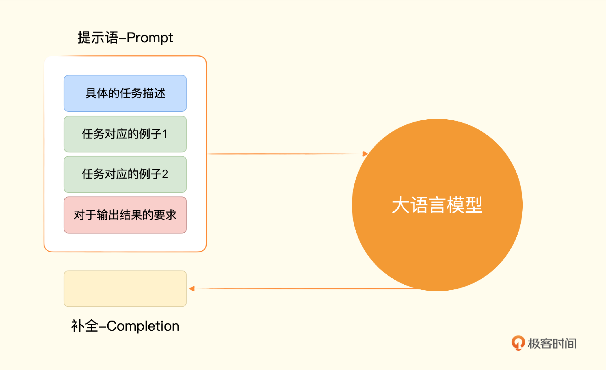

# 03｜巧用提示语，说说话就能做个聊天机器人
你好，我是徐文浩。

这一讲，我们来看看Open AI提供的Completion这个API接口。相信已经有不少人试过和ChatGPT聊天了，也有过非常惊艳的体验，特别是让ChatGPT帮我们写各种材料。那么，我们不妨也从这样一个需求开始吧。

## AI 客服

在这一波AIGC浪潮之前，我也做过一个智能客服的产品。我发现智能客服的回答，往往是套用固定的模版。这个的缺点，就是每次的回答都一模一样。当然，我们可以设计多个模版轮换着表达相同的意思，但是最多也就是三四个模版，整体的体验还是相当呆板。

不过，有了GPT这样的生成式的语言模型，我们就可以让AI自动根据我们的需求去写文案了。只要把我们的需求提给Open AI提供的Completion接口，他就会自动为我们写出这样一段文字。

```python
import openai
import os

openai.api_key = os.environ.get("OPENAI_API_KEY")
COMPLETION_MODEL = "text-davinci-003"

prompt = '请你用朋友的语气回复给到客户，并称他为“亲”，他的订单已经发货在路上了，预计在3天之内会送达，订单号2021AEDG，我们很抱歉因为天气的原因物流时间比原来长，感谢他选购我们的商品。'

def get_response(prompt, temperature = 1.0):
    completions = openai.Completion.create (
        engine=COMPLETION_MODEL,
        prompt=prompt,
        max_tokens=1024,
        n=1,
        stop=None,
        temperature=temperature,
    )
    message = completions.choices[0].text
    return message


```

```python
print(get_response(prompt))

```

> 亲，您的订单已经顺利发货啦！订单号是2021AEDG，预计在3天之内会寄到您指定的地址。不好意思，给您带来了不便，原计划到货时间受天气原因影响而有所延迟。期待您收到衣服后给我们反馈意见哦！谢谢你选购我们的商品！

```python
print(get_response(prompt))

```

> 亲，您的订单2021AEDG刚刚已经发出，预计3天之内就会送达您的手中。抱歉由于天气的原因造成了物流延迟，但我们会尽快将订单发到您的手中。感谢您对我们的支持！

**相同的提示语，连续调用两次之后，给到了含义相同、遣词造句不同的结果。**

我在这里列出了一段非常简单的代码。代码里面，我们给Open AI提供的Completion接口发送了一段小小的提示语（Prompt）。这段提示语要求AI用亲切的语气，告诉客户他的订单虽然已经发货，但是因为天气原因延迟了。并且我们还加了一个小小的语言风格上的要求，我们希望AI用朋友的口吻向用户说话，并且称用户为“亲”。然后，我们尝试连续用完全相同的参数调用了两次AI。

可以看到，AI的确理解了我们的意思，满足了我们的要求，给出了一段正确合理的回复。 **其中有两点我觉得殊为不易** **。**

1. 他的确用“亲”来称呼了用户，并且用了一些语气词，显得比较亲切。
2. 他正确地提取到了输入内容里的订单号，并且在回复内容里也把这个订单号返回给了用户。

而且，两次返回的文案内容意思是相同的，但是具体的遣词造句又有所不同。这样通过一句合理的提示语，我们就可以让自己的智能客服自己遣词造句，而不是只能套用一个固定的模版。

而每次回复的内容不一样，则归功于我们使用的一个参数temperature。这个参数的输入范围是0-2之间的浮点数，代表输出结果的随机性或者说多样性。在这里，我们选择了1.0，也就是还是让每次生成的内容都有些不一样。你也可以把这个参数设置为0，这样，每次输出的结果的随机性就会比较小。

我将temperature设置为0，你可以看到两句内容的遣词造句就基本一致了。

```python
print(get_response(prompt, 0.0))

```

> 亲，您的订单2021AEDG已经发货，预计在3天之内会送达，由于天气原因，物流时间比原来长，我们深表歉意。感谢您选购我们的商品，祝您购物愉快！

```python
print(get_response(prompt, 0.0))

```

> 亲，您的订单2021AEDG已经发货，预计在3天之内会送达。很抱歉因为天气的原因物流时间比原来长，感谢您选购我们的商品，祝您购物愉快！

**这个参数该怎么设置，取决于实际使用的场景。** 如果对应的场景比较严肃，不希望出现差错，那么设得低一点比较合适，比如银行客服的场景。如果场景没那么严肃，有趣更加重要，比如讲笑话的机器人，那么就可以设置得高一些。

既然看了temperature参数，我们也就一并看一下 Completion 这个接口里面的其他参数吧。

- 第一个参数是 **engine**，也就是我们使用的是Open AI的哪一个引擎，这里我们使用的是 text-davinci-003，也就是现在可以使用到的最擅长根据你的指令输出内容的模型。当然，也是调用成本最高的模型。

- 第二个参数是 **prompt**，自然就是我们输入的提示语。接下来，我还会给你更多使用提示语解决不同需求的例子。

- 第三个参数是 **max\_tokens**，也就是调用生成的内容允许的最大token数量。你可以简单地把token理解成一个单词。实际上，token是分词之后的一个字符序列里的一个单元。有时候，一个单词会被分解成两个token。比如，icecream是一个单词，但是实际在大语言模型里，会被拆分成 ice 和 cream 两个token。这样分解可以帮助模型更好地捕捉到单词的含义和语法结构。一般来说，750个英语单词就需要1000个token。我们这里用的 text-davinci-003 模型，允许最多有4096个token。需要注意，这个数量既包括你输入的提示语，也包括AI产出的回答，两个加起来不能超过4096个token。比如，你的输入有1000个token，那么你这里设置的 max\_tokens 就不能超过 3096。不然调用就会报错。

- 第四个参数 **n**，代表你希望AI给你生成几条内容供你选择。在这样自动生成客服内容的场景里，我们当然设置成1。但是如果在一些辅助写作的场景里，你可以设置成3或者更多，供用户在多个结果里面自己选择自己想要的。

- 第五个参数 **stop**，代表你希望模型输出的内容在遇到什么内容的时候就停下来。这个参数我们常常会选用 "\\n\\n"这样的连续换行，因为这通常意味着文章已经要另起一个新的段落了，既会消耗大量的token数量，又可能没有必要。我们在下面试了一下，将“，”作为stop的参数，你会发现模型在输出了“亲”之后就停了下来。


```python
print(get_response(prompt, 0.0, "，"))

```

> 亲

Completion这个接口当然还有其他参数，不过一时半会儿我们还用不着，后面实际用得上的时候我们再具体介绍。如果你现在就想知道，那么可以去查看一下 [官方文档](https://platform.openai.com/docs/api-reference/completions/create)。如果你觉得英语不太好，可以试着用“请用中文解释一下这段话的意思”作为提示语，调用Open AI的模型来理解文档的含义。

## AI 聊天机器人

上面我们知道了怎么用一句提示语让AI完成一个任务，就是回答一个问题。不过，我们怎么能让AI和人“聊起来”呢？特别是怎么完成多轮对话，让GPT能够记住上下文。比如，当用户问我们，“iPhone14拍照好不好”，我们回答说“很好”。然后又问“它的价格是多少的时候”，我们需要理解，用户这里问的“它”就是指上面的iPhone。

对于聊天机器人来说，只理解当前用户的句子是不够的，能够理解整个上下文是必不可少的。而GPT的模型，要完成支持多轮的问答也并不复杂。我们只需要在提示语里增加一些小小的工作就好了。

想要实现问答，我们只需要在提示语里，在问题之前加上 **“Q :”** 表示这是一个问题，然后另起一行，加上 **“A :”** 表示我想要一个回答，那么 Completion的接口就会回答你在 “Q : ” 里面跟的问题。比如下面，我们问AI “鱼香肉丝怎么做”。它就一步一步地列出了制作步骤。

```python
question =  """
Q : 鱼香肉丝怎么做？
A :
"""
print(get_response(question))

```

> 1. 准备好食材：500克猪里脊肉，2个青椒，2个红椒，1个洋葱，2勺蒜蓉，3勺白糖，适量料酒，半勺盐，2勺生抽，2勺酱油，2勺醋，少许花椒粉，半勺老抽，适量水淀粉。
> 2. 将猪里脊肉洗净，沥干水分，放入料酒、盐，抓捏抓匀，腌制20分钟。
> 3. 将青红椒洗净，切成丝，洋葱洗净，切成葱花，蒜末拌入小苏打水中腌制。
> 4. 将猪里脊肉切成丝，放入锅中，加入洋葱，炒制至断生，加入青红椒，炒匀，加入腌制好的蒜末，炒制至断生。
> 5. 将白糖、生抽、酱油、醋、花椒粉、老抽、水淀粉倒入锅中，翻炒匀，用小火收汁，调味即可。

而要完成多轮对话其实也不麻烦，我们只要把之前对话的内容也都放到提示语里面，把整个上下文都提供给AI。AI就能够自动根据上下文，回答第二个问题。比如，你接着问“那蚝油牛肉呢？”。我们不要只是把这个问题传给AI，而是把前面的对话也一并传给AI，那么AI自然知道你问的“那蚝油牛肉呢？”是指怎么做，而不是去哪里买或者需要多少钱。

- Q：鱼香肉丝怎么做？
- A：详细的鱼香肉丝的做法
- Q：那蚝油牛肉呢？
- A：

```python
question =  """
Q : 鱼香肉丝怎么做？
A :
1.准备好食材：500克猪里脊肉，2个青椒，2个红椒，1个洋葱，2勺蒜蓉，3勺白糖，适量料酒，半勺盐，2勺生抽，2勺酱油，2勺醋，少许花椒粉，半勺老抽，适量水淀粉。
2.将猪里脊肉洗净，沥干水分，放入料酒、盐，抓捏抓匀，腌制20分钟。
3.将青红椒洗净，切成丝，洋葱洗净，切成葱花，蒜末拌入小苏打水中腌制。
4.将猪里脊肉切成丝，放入锅中，加入洋葱，炒制至断生，加入青红椒，炒匀，加入腌制好的蒜末，炒制至断生。
5.将白糖、生抽、酱油、醋、花椒粉、老抽、水淀粉倒入锅中，翻炒匀，用小火收汁，调味即可。

Q : 那蚝油牛肉呢？
A :
"""
print(get_response(question))

```

> 1.准备好食材：500克牛肉，2茶匙葱姜蒜末，6茶匙蚝油，4茶匙米醋，3茶匙白糖，3茶匙酱油，1茶匙料酒，半茶匙盐。
>
> 2.将牛肉洗净，放入清水中，加入料酒、盐，煮至牛肉熟透，捞出沥干水分，放入碗中。
>
> 3.在另一锅中，倒入蚝油，米醋，白糖，酱油翻炒均匀，加入葱姜蒜末，翻炒均匀。
>
> 4.将牛肉碗中放入蚝油汁中，炒匀，加入酱油，翻炒至汁呈红色，收汁成浓稠状即可。

我在下面贴了一段完整的Python代码叫做food\_chatbot，它会从命令行读入你的问题，然后给出回答。你可以继续提问，然后我们把整个对话过程都发送给AI来回答。你可以尝试着体验一下，AI是不是能够理解整个对话过程的上下文。你想要退出的时候，就在需要提问的时候，输入 “bye” 就好了。

```python
import openai
import os

openai.api_key = os.environ["OPENAI_API_KEY"]

def ask_gpt3(prompt):
    response = openai.Completion.create(
        engine="text-davinci-003",
        prompt=prompt,
        max_tokens=512,
        n=1,
        stop=None,
        temperature=0.5,
    )

    message = response.choices[0].text.strip()
    return message

print("你好，我是一个聊天机器人，请你提出你的问题吧?")

questions = []
answers = []

def generate_prompt(prompt, questions, answers):
    num = len(answers)
    for i in range(num):
        prompt += "\n Q : " + questions[i]
        prompt += "\n A : " + answers[i]
    prompt += "\n Q : " + questions[num] + "\n A : "
    return prompt

while True:
    user_input = input("> ")
    questions.append(user_input)
    if user_input.lower() in ["bye", "goodbye", "exit"]:
        print("Goodbye!")
        break

    prompt = generate_prompt("", questions, answers)

    answer = ask_gpt3(prompt)
    print(answer)
    answers.append(answer)

```

## 让AI帮我解决情感分析问题

可以看到，巧妙地利用提示语，我们就能够让AI完成多轮的问答。那你是不是想到了，我们能不能用同样的方式，来解决上一讲我们说到的情感分析问题呢？毕竟，很多人可能没有学习过任何机器学习知识，对于向量距离之类的概念也忘得差不多了。那么，我们能不能不用任何数学概念，完全用自然语言的提示语，让AI帮助我们判断一下用户评论的情感是正面还是负面的呢？

那我们不妨来试一下，告诉AI我们想要它帮助我们判断用户的评论情感上是正面的还是负面的，并且把上一讲两个iPhone评论的例子给它，告诉它什么是正面的，什么是负面的。然后，再给他一段新的评论，看看他是不是会回复正确的答案。

我把对应的代码放在了下面，我们仍然只是简单地调用 Completion 的API一次。只是需要再把提示语分成三个组成部分。

1. 第一部分是我们给到AI的指令，也就是告诉它要去判断用户评论的情感。
2. 第二部分是按照一个固定格式给它两个例子，一行以“评论：”开头，后面跟着具体的评论，另一行以“情感：”开头，后面跟着这个例子的情感。
3. 第三部分是给出我们希望AI判定的评论，同样以“评论：”开头跟着我们想要它判定的评论，另一行也以“情感：”开头，不过后面没有内容，而是等着AI给出判定。

```python
prompts = """判断一下用户的评论情感上是正面的还是负面的
评论：买的银色版真的很好看，一天就到了，晚上就开始拿起来完系统很丝滑流畅，做工扎实，手感细腻，很精致哦苹果一如既往的好品质
情感：正面

评论：随意降价，不予价保，服务态度差
情感：负面
"""

good_case = prompts + """
评论：外形外观：苹果审美一直很好，金色非常漂亮
拍照效果：14pro升级的4800万像素真的是没的说，太好了，
运行速度：苹果的反应速度好，用上三五年也不会卡顿的，之前的7P用到现在也不卡
其他特色：14pro的磨砂金真的太好看了，不太高调，也不至于没有特点，非常耐看，很好的
情感：
"""

print(get_response(good_case))

```

```python
 正面

```

```python
bad_case = prompts + """
评论：信号不好电池也不耐电不推荐购买
情感
"""

print(get_response(bad_case))

```

```python
负面

```

我们重新从京东商城的iPhone评论区随机找两个和上次不太一样的好评和差评，可以看到，结果是准确的。这是不是很棒？我们不需要任何机器学习的相关知识，用几句话就能够轻松搞定情感分析问题。

注：常见的大模型的上下文学习能力，通过几个例子，就能回答正确的结果。

而上面这个“给一个任务描述、给少数几个例子、给需要解决的问题”这样三个步骤的组合，也是大语言模型里使用提示语的常见套路。一般我们称之为 **Few-Shots Learning（少样本学习）**，也就是给一个或者少数几个例子，AI就能够举一反三，回答我们的问题。

## 小结

好了，到这里相信你已经体会到Completion这个接口的魔力了。只要给出合理的提示语，Open AI的大语言模型就能神奇地完成我们想要完成的任务。

在这一讲里，我们就看到了三个例子，第一个是给AI一个明确的指令，让它帮我重写一段话。第二个，是将整个对话的历史记录都发送出去，并且通过Q和A提示AI这是一段对话，那么AI自然能够理解整个上下文，搞清楚新的问题是指“蚝油牛肉怎么做”而不是“哪里买或者怎么吃”。而第三个例子，我们则是给了AI几个正面情感和负面情感的例子，它就能够直接对新的评论做出准确的情感判断。

可以看到，善用合适的提示语，能够让大语言模型完成很多任务。这也是为什么，我们认为它已经是我们迈向通用人工智能的第一步。

## 课后练习

上一讲我给出了一些数据集，通过向量距离来进行正面和负面情感的判断。那么，你能不能试着用这一讲的Few-Shots Learning的方法，在对应的数据集上也运行一下，看看通过这种方式进行情感分析的准确率是多少？

欢迎你在留言区分享你的思考，也欢迎你把这节课分享给感兴趣的朋友，我们下一讲再见。

## 推荐尝试

在使用GPT类型的模型的时候，提示语非常重要。所以，有人专门制作了一个叫做 [AIPRM的浏览器插件](https://chrome.google.com/webstore/detail/aiprm-for-chatgpt/ojnbohmppadfgpejeebfnmnknjdlckgj)，包含了很多总结出来有效的提示语。你可以试着安装，看看别人都用了什么有趣的提示语。