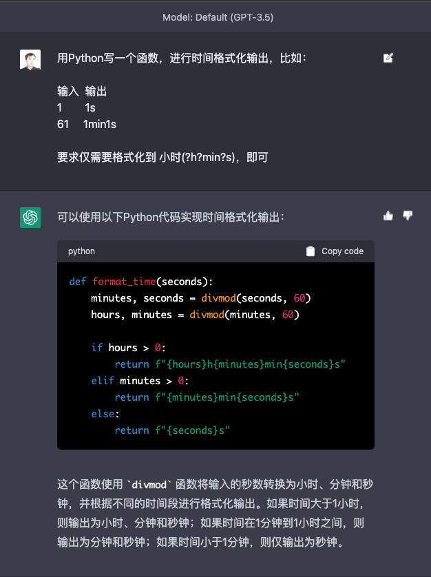
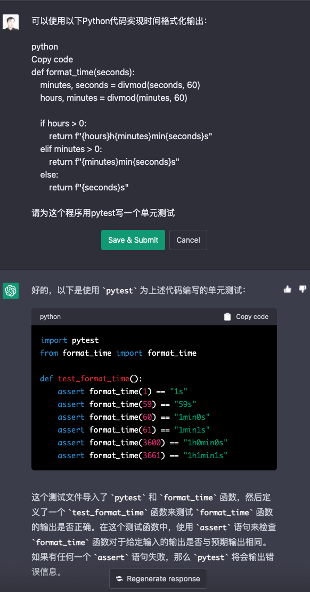

# 13 ｜让AI帮你写测试，体验多步提示语
你好，我是徐文浩。

上一讲，我们一起通过ChatGPT做了一个小应用。不过，这个过程并不是一个“自动档”的。我们尝试一步一步输入我们的需求，给到ChatGPT，并根据拿到的指示尝试运行代码。通过和ChatGPT不断地交互，我们最终完成了一个小应用。

虽然这在我们探索性地开发一些功能的时候，已经极大地提高了我们的效率。但是这个过程并不能做成一个产品。我们理想中的产品应该是“自动档”的，我们只要用自然语言输入自己的需求，对应的代码就自动写出来了。如果中间出现了错误，AI可以自己拿到反馈来更正，而不需要我们人工去介入调试，或者复制粘贴。

## 先让GPT-4写个代码

这个思路听起来似乎有些科幻，但是随着GPT-4的发布，以及未来模型能力的进一步增长，这其实并不是遥不可及的。不过，这个时候你应该还只有GPT-3.5的API权限。所以这一讲，我们还是先把目标放低一点，先来 **通过大语言模型，帮我们自动写单元测试代码**。整个过程仍然是一个自动档的体验，只是能够提供的能力还相对比较简单，仅限于为现有代码提供单元测试而已。

这个想法，源自OpenAI Cookbook提供的 [AI 写单元测试的示例](https://github.com/openai/openai-cookbook/blob/main/examples/Unit_test_writing_using_a_multi-step_prompt.ipynb)。但是那个例子里面的代码，已经不能使用了，因为对应的code-davinci-002模型已经被OpenAI下线了。但是例子里，分步骤分析问题，通过多个Prompts来完成单元测试的想法，还是非常有借鉴意义的。

我相信学完这一讲之后，随着你拿到GPT-4的API乃至未来可能会出现的GPT-5，你都完全可以用同样的方法完成更复杂的“自动写代码”的程序。

## 设计一个有些挑战的小题目

要写测试，我们要先有一个程序。为了避免这个题目本身就在AI的训练数据集里面，它直接知道答案，我们就不选用像Leetcode这样的题库了。我用了这样一个我觉得很有意思的小题目，也就是让Python根据我们输入的一个整数代表的秒数，格式化成一段自然语言描述的时间。比如，输入1就返回1s，输入61就返回1min1s。

需求：

```python
用Python写一个函数，进行时间格式化输出，比如：
输入  输出
1  1s
61  1min1s
要求仅需要格式化到小时(?h?min?s)，即可

```

题目有了，我们还需要一个正确的解题程序。我们今天的重点不是怎么用AI刷题，所以我们不如直接让ChatGPT帮我们把程序写好。



这是对应的Notebook里面的代码。

```python
def format_time(seconds):
    minutes, seconds = divmod(seconds, 60)
    hours, minutes = divmod(minutes, 60)
    if hours > 0:
        return f"{hours}h{minutes}min{seconds}s"
    elif minutes > 0:
        return f"{minutes}min{seconds}s"
    else:
        return f"{seconds}s"

```

可以看到，AI快速给出了一个小程序，看上去没啥问题，能够完成我们想要的基本功能。

既然ChatGPT可以写代码，我们自然也可以让它帮我们把单元测试也写好。



```python
conda install pytest

```

这是对应的Notebook里面的代码。

```python
import pytest

def test_format_time():
    assert format_time(1) == "1s"
    assert format_time(59) == "59s"
    assert format_time(60) == "1min0s"
    assert format_time(61) == "1min1s"
    assert format_time(3600) == "1h0min0s"
    assert format_time(3661) == "1h1min1s"

```

乍一看，我们的单元测试已经写完了，那这一讲就结束了吗？当然不是了。如果你是一个比较有经验的程序员，你就会发现这个单元测试其实还是有好几个问题的。

1. 这个测试没有考虑负数。如果我们输入的是负数会怎么样？
2. 没有考虑非整数类型的输入，如果我们输入浮点数 1.0 会怎么样？字符串“abc”会怎么样？nil这样的空值会怎么样？
3. 是即使是整数，我们还没有考虑过，超过24小时的话，格式化后的结果是怎么样的。

## 分解步骤撰写Prompts

所以，很多事情不是我们直接把问题一塞，给到ChatGPT就能解决的。 **我们需要反过来自己思考一下，如果我们自己来为一段代码写单元测试，我们会怎么做？**

OpenAI的示例里给出了一个很好的思路，那就是把问题拆分成三个步骤。

1. 把代码提交给大语言模型，让大语言模型解释一下，这个代码是在干什么。
2. 把代码以及代码的解释一起交给大语言模型，让大语言模型规划一下，针对这个代码逻辑，我们到底要写哪几个TestCase。如果在这个过程里，大语言模型规划的TestCase数量太少，那么我们就重复第二步，让AI多生成几个TestCase。
3. 针对上面的TestCase的详细描述，再提交给大语言模型，让它根据这些描述生成具体的测试代码。在这个过程中，我们还会对生成的代码，进行一次语法检查，如果语法检查没法通过，我们就要让AI重新生成一下。这个可以避免因为大语言模型的概率采样不稳定，导致生成的代码无法运行的问题。

最后，我们来实际运行一下这些代码，看看我们的代码能不能通过这些自动化测试。

### 请AI解释要测试的代码

那最后，我们就根据这个步骤一步步拆解，通过Python程序来把整个过程“自动化”掉。

````python
def gpt35(prompt, model="text-davinci-002", temperature=0.4, max_tokens=1000,
          top_p=1, stop=["\n\n", "\n\t\n", "\n    \n"]):
    response = openai.Completion.create(
        model=model,
        prompt = prompt,
        temperature = temperature,
        max_tokens = max_tokens,
        top_p = top_p,
        stop = stop
        )
    message = response["choices"][0]["text"]
    return message

code = """
def format_time(seconds):
    minutes, seconds = divmod(seconds, 60)
    hours, minutes = divmod(minutes, 60)

    if hours > 0:
        return f"{hours}h{minutes}min{seconds}s"
    elif minutes > 0:
        return f"{minutes}min{seconds}s"
    else:
        return f"{seconds}s"
"""

def explain_code(function_to_test, unit_test_package="pytest"):
    prompt = f""""# How to write great unit tests with {unit_test_package}

In this advanced tutorial for experts, we'll use Python 3.10 and `{unit_test_package}` to write a suite of unit tests to verify the behavior of the following function.
```python
{function_to_test}

Before writing any unit tests, let's review what each element of the function is doing exactly and what the author's intentions may have been.
- First,"""
    response = gpt35(prompt)
    return response, prompt

code_explaination, prompt_to_explain_code = explain_code(code)
print(code_explaination)

````

在第一步里，我们的代码做了这样几件事情。

首先是定义了一个gpt35的函数，对调用GPT3.5的模型做了简单的封装。其中有2点需要注意。

1. 我们默认使用 text-davinci-002 模型，这是一个通过监督学习微调的生成文本的模型。因为这里我们希望生成目标明确的文本的代码解释，所以选用了这个模型。
2. 我们对stop做了特殊的设置，只要连续两个换行或者类似连续两个换行的情况出现，就中止数据的生成。这是避免模型一口气连测试代码也生成出来。那样的话，我们没法对测试代码的生成提出具体的要求。通过stop，我们可以确保在第一步，只解释现在的功能代码有什么用。

然后，我们通过一组精心设置过的提示语，让GPT模型为我们来解释代码。我们在提示语里做了4件事情。

- 指定了使用 pytest 这个测试包。
- 把对应要测试的代码，也提供给了GPT模型。
- 告诉AI，要精确描述代码做了什么。
- 在最后一行用 “\- First” 开头，引导GPT模型，逐步分行描述要测试的代码干了什么。

输出结果：

```plain
 we use the `divmod` built-in function to get the quotient and remainder of `seconds` divided by 60. This is assigned to the variables `minutes` and `seconds`, respectively.
- Next, we do the same thing with `minutes` and 60, assigning the results to `hours` and `minutes`.
- Finally, we use string interpolation to return a string formatted according to how many hours/minutes/seconds are left.

```

运行第一步的代码，我们可以看到，AI回复了几个步骤，详细地描述了我们格式化时间的代码是怎么做的。

### 请AI根据代码解释制定测试计划

接下来，我们就根据生成的这个详细描述，请AI为我们制定一下具体的测试计划。

```python
def generate_a_test_plan(full_code_explaination, unit_test_package="pytest"):
    prompt_to_explain_a_plan = f"""

A good unit test suite should aim to:
- Test the function's behavior for a wide range of possible inputs
- Test edge cases that the author may not have foreseen
- Take advantage of the features of `{unit_test_package}` to make the tests easy to write and maintain
- Be easy to read and understand, with clean code and descriptive names
- Be deterministic, so that the tests always pass or fail in the same way

`{unit_test_package}` has many convenient features that make it easy to write and maintain unit tests. We'll use them to write unit tests for the function above.

For this particular function, we'll want our unit tests to handle the following diverse scenarios (and under each scenario, we include a few examples as sub-bullets):
-"""
    prompt = full_code_explaination + prompt_to_explain_a_plan
    response = gpt35(prompt)
    return response, prompt

test_plan, prompt_to_get_test_plan = generate_a_test_plan(prompt_to_explain_code + code_explaination)
print(test_plan)

```

我们整个测试计划的提示语，同样经过了精心设计。我们先是对AI做了几个要求。

1. 我们要求测试用例，尽量考虑输入的范围广一些。
2. 我们要求AI想一些连代码作者没有想到过的边界条件。
3. 我们希望AI能够利用好 pytest 这个测试包的特性。
4. 希望测试用例清晰易读，测试的代码要干净。
5. 我们要求测试代码的输出结果是确定的，要么通过，要么失败，不要有随机性。

**然后，我们的提示语并没有立刻让AI去写测试代码，而是说我们要举几个例子。这样，AI就会生成一系列的示例。** 我们对测试用例的提示是非常详尽的，这也是我们前面第一步没有直接让AI生成测试用例的原因。因为那样的话，我们没法在提示语中间插入这些详尽的要求。对具体的测试用例，只能寄希望于AI想得多一些。

最后，我们发给AI的提示语，则是既包括了第一步要求解释代码的内容，也包括AI生成的对代码的解释，以及这里我们新增的对测试用例的要求，提供了非常详细的上下文，这样AI的表现也会更好、更有逻辑性。

输出结果：

```plain
 Normal behavior:
    - `format_time(0)` should return `"0s"`
    - `format_time(59)` should return `"59s"`
    - `format_time(60)` should return `"1min0s"`
    - `format_time(119)` should return `"1min59s"`
    - `format_time(3600)` should return `"1h0min0s"`
    - `format_time(3601)` should return `"1h0min1s"`
    - `format_time(3660)` should return `"1h1min0s"`
    - `format_time(7200)` should return `"2h0min0s"`
- Invalid inputs:
    - `format_time(None)` should raise a `TypeError`
    - `format_time("abc")` should raise a `TypeError`
    - `format_time(-1)` should raise a `ValueError`

```

我运行了一下这个代码，可以看到，AI提供了很多测试用例。并且，里面考虑了好几种情况，包括我们前面提到的负数这样的特殊条件，也包括输入字符串，以及None这样的内容。

不过，生成哪些用例其实是有一定的随机性的。这个也是大语言模型的一个缺点，就是可控性差。有时候，AI可能就只生成了3个用例，那样的话就会有很多情况我们的用例覆盖不到。

所以，我们可以在生成用例之后，加一个步骤，检查一下到底生成了多少个用例。如果太少的话，我们就让AI再生成一些。我在下面给了一段示例代码，通过“\\n-”这样一个换行加横杆的标记来判断之前生成的测试用例数量，如果比我们设定的下限少，我们就再添加一段提示语，让AI再生成一些。

这里的提示语，我们要特别提醒AI考虑一下测试罕见情况和边界条件。

```python
not_enough_test_plan = """The function is called with a valid number of seconds
    - `format_time(1)` should return `"1s"`
    - `format_time(59)` should return `"59s"`
    - `format_time(60)` should return `"1min"`
"""

approx_min_cases_to_cover = 7
elaboration_needed = test_plan.count("\n-") +1 < approx_min_cases_to_cover
if elaboration_needed:
        prompt_to_elaborate_on_the_plan = f"""

In addition to the scenarios above, we'll also want to make sure we don't forget to test rare or unexpected edge cases (and under each edge case, we include a few examples as sub-bullets):
-"""
        more_test_plan, prompt_to_get_test_plan = generate_a_test_plan(prompt_to_explain_code + code_explaination + not_enough_test_plan + prompt_to_elaborate_on_the_plan)
        print(more_test_plan)

```

输出结果：

```plain
 The function is called with a valid number of seconds
    - `format_time(1)` should return `"1s"`
    - `format_time(59)` should return `"59s"`
    - `format_time(60)` should return `"1min"`
- The function is called with an invalid number of seconds
    - `format_time(-1)` should raise a `ValueError`
    - `format_time("60")` should raise a `TypeError`
- The function is called with a `None` value
    - `format_time(None)` should raise a `TypeError`

```

### 根据测试计划生成测试代码

当然，大部分情况下，生成的测试用例数都和我们前面的实际情况是一样的。那我们就可以直接用原来的代码、代码的解释以及测试用例，作为提示语，让AI帮我们写具体的测试了。

这里的提示语也没有什么稀奇的，其实就是把前面已经生成的所有内容拼接在一起，然后要求AI根据前面的内容来写具体的测试代码。唯一有一点值得注意的是，为了避免AI忘记一开头功能代码的内容，我们特地再在提示语的最后，再次给AI看了一下我们要测试的功能代码。

````python
def generate_test_cases(function_to_test, unit_test_package="pytest"):
    starter_comment = "Below, each test case is represented by a tuple passed to the @pytest.mark.parametrize decorator"
    prompt_to_generate_the_unit_test = f"""

Before going into the individual tests, let's first look at the complete suite of unit tests as a cohesive whole. We've added helpful comments to explain what each line does.
```python
import {unit_test_package}  # used for our unit tests

{function_to_test}

#{starter_comment}"""
    full_unit_test_prompt = prompt_to_explain_code + code_explaination + test_plan + prompt_to_generate_the_unit_test
    return gpt35(model="text-davinci-003", prompt=full_unit_test_prompt, stop="```"), prompt_to_generate_the_unit_test

unit_test_response, prompt_to_generate_the_unit_test = generate_test_cases(code)
print(unit_test_response)

````

输出结果：

```python
.
#The first element of the tuple is the name of the test case, and the second element is the value to be passed to the format_time() function.
@pytest.mark.parametrize('test_input,expected', [
    ('0', '0s'),
    ('59', '59s'),
    ('60', '1min0s'),
    ('119', '1min59s'),
    ('3600', '1h0min0s'),
    ('3601', '1h0min1s'),
    ('3660', '1h1min0s'),
    ('7200', '2h0min0s'),
])
def test_format_time(test_input, expected):
    #For each test case, we call the format_time() function and compare the returned value to the expected value.
    assert format_time(int(test_input)) == expected

#We use the @pytest.mark.parametrize decorator again to test the invalid inputs.
@pytest.mark.parametrize('test_input', [
    None,
    'abc',
    -1
])
def test_format_time_invalid_inputs(test_input):
    #For each invalid input, we expect a TypeError or ValueError to be raised.
    with pytest.raises((TypeError, ValueError)):
        format_time(test_input)

```

运行一下这段提示语，我们就拿到了最终输出的测试代码。可以看到，这个测试代码不仅有正常情况下的测试，也包含了异常输入的测试。

### 通过AST库进行语法检查

不过这还没有完，我们最好还是再检查一下生成的测试代码的语法，这个可以通过Python的AST库来完成。不过需要注意，检查语法的时候，我们不仅需要生成的测试代码，也需要原来的功能代码，不然是没办法通过语法检查的。

````python
import ast

code_start_index = prompt_to_generate_the_unit_test.find("```python\n") + len("```python\n")
code_output = prompt_to_generate_the_unit_test[code_start_index:] + unit_test_response
try:
    ast.parse(code_output)
except SyntaxError as e:
    print(f"Syntax error in generated code: {e}")

````

很幸运，我们一次就通过了语法检查。那么接下来，我们就可以把对应的整个测试代码打印出来，执行试一试。

```python
print(code_output)

```

输出结果：

```python
import pytest  # used for our unit tests

def format_time(seconds):
    minutes, seconds = divmod(seconds, 60)
    hours, minutes = divmod(minutes, 60)

    if hours > 0:
        return f"{hours}h{minutes}min{seconds}s"
    elif minutes > 0:
        return f"{minutes}min{seconds}s"
    else:
        return f"{seconds}s"

#Below, each test case is represented by a tuple passed to the @pytest.mark.parametrize decorator.
#The first element of the tuple is the name of the test case, and the second element is the value to be passed to the format_time() function.
@pytest.mark.parametrize('test_input,expected', [
    ('0', '0s'),
    ('59', '59s'),
    ('60', '1min0s'),
    ('119', '1min59s'),
    ('3600', '1h0min0s'),
    ('3601', '1h0min1s'),
    ('3660', '1h1min0s'),
    ('7200', '2h0min0s'),
])
def test_format_time(test_input, expected):
    #For each test case, we call the format_time() function and compare the returned value to the expected value.
    assert format_time(int(test_input)) == expected

#We use the @pytest.mark.parametrize decorator again to test the invalid inputs.
@pytest.mark.parametrize('test_input', [
    None,
    'abc',
    -1
])
def test_format_time_invalid_inputs(test_input):
    #For each invalid input, we expect a TypeError or ValueError to be raised.
    with pytest.raises((TypeError, ValueError)):
        format_time(test_input)

```

### 看看自动生成的测试帮我们抓了什么Bug

我们可以把对应生成的代码，单独复制到一个auto\_unit\_test.py文件里面。然后去命令行里执行一下 pytest 这个命令，看看结果是怎样的。我这里，对应的会有一个测试用例失败，就是当输入是-1的时候，测试用例预期会遇到一个TypeError或者ValueError的报错，但是实际并没有。


我们可以试着在Notebook里面调用一下 format\_time(-1)，看看自动化测试跑得对不对。

```python
format_time(-1)

```

输出结果：

```python
'59min59s'

```

可以看到，输入-1的时候，输出变成了59min59s，看来AI生成的测试代码的确帮我们捕捉到了一个Bug。

## 小结

好了，到这里这一讲也就结束了。我们也有了一段完整的，可以针对一个Python函数生成一整套自动化测试的功能了，而且它还真的帮我们抓到了一个Bug。 **生成整套测试代码的过程里，我们不需要人工地复制粘帖任何内容，全都是代码自动完成的，是一个“自动档”的过程。**

之所以能做到这一点，是因为我们巧妙地利用了一个方法，就是将一个问题，拆分成多个提示语的步骤，循序渐进地让AI通过解释代码，构造测试用例，最后再根据代码的解释和设计的测试用例，生成最终的自动化测试。

多步提示语带来的一个好处，就是我们的内容是更加有条理、有逻辑的，也更符合我们平时写文字的方式，而不是一股脑地把各种要求都放在提示语的开头，这在解决复杂问题时往往效果不好。

此外，我们这里使用的提示语也非常重要。正是因为我们能够分步骤提示AI，所以我们能在拿到代码的解释之后，让AI考虑各种边界条件。而AI也很给力，给出-1、None这样的特殊输入，让我们的测试代码最终真的抓住了程序里的Bug。

回过头来看，如果我们只是直接把代码往ChatGPT里一贴，虽然也能生成测试用例，但是那些测试用例就比较欠考虑，不会涵盖各种边角的情况。

## 思考题

这一讲的代码有点长，思考题部分需要你做的事情也多一些。

1. 你可以试着减少我们的提示语或者提示步骤，看看生成的测试用例有什么样的变化。
2. 目前我们的代码，是过程式地一步步给你演示整个测试代码是如何生成的。如果语法检查出错了，其实我们应该要从头开始重试一遍，再生成测试代码。你可以试着把整个代码封装修改，变成一个会自动重试3次的函数。让我们可以直接调用，来为Python代码生成自动化测试。
3. 我们这一讲里的提示语是借鉴的OpenAI Cookbook里的样例，你能不能自己尝试总结一下，这些提示语有哪些值得借鉴的常用方法？

欢迎你把思考后的结果分享在评论区，也欢迎你把这一讲分享给感兴趣的朋友，我们下一讲再见。

## 推荐阅读

之所以我们要循序渐进地提示AI，让AI生成例子再生成代码，是因为现在的大语言模型，有一种叫做“思维链（CoT）”的能力。当我们给出更详细的推理步骤的时候，AI的表现会更好。在OpenAI Cookbook里，专门有一章讲解 [思维链能力](https://github.com/openai/openai-cookbook/blob/main/techniques_to_improve_reliability.md)，你可以去好好研读一下。